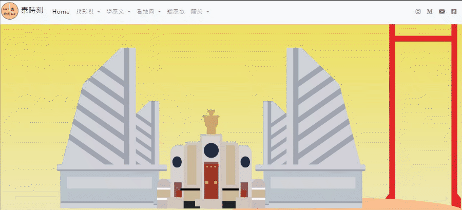

# THAISKR 
[web link](https://jane0819tw.github.io/thaiskr/)
a project that is about my website.

this website contains these functions pages: 
* [index](#index)

* findMovie(#findMovie)
* findTV(#findTV)
* keyboard(#keyboard)
* letterGame(#letterGame)
* btsRoute(#btsRoute)
* weather(#weather)
* youtube player(#player)
* newspaper(#newspaper)
## data api 
* movies and dramas [TMDB](https://www.themoviedb.org/?language=zh-TW)
* 新聞來源 [the news api](https://newsapi.org/)
* thai letters files [omniglot](https://www.omniglot.com/writing/thai.htm)
* thai songs [youtube api](https://developers.google.com/youtube/v3)
* weather data[openweather](https://openweathermap.org/api)
* GIS map data [bangkokgis](http://www.bangkokgis.com/modules.php?m=download_shapefile)
## main skills
* use axios to load api data.
* use d3 to show map data. 
## pages
### index
* this page the first part I use many css ::before and ::after to write a landmark--anusawari in thailand bangkok.
when you click the landmark, you will get a thai quote in my object-format database.
* the second main part is my website functions description, I use skrollr to do the animation. 

